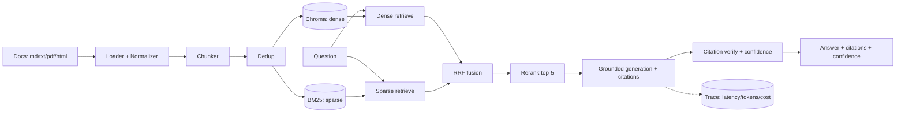

# RAG Hybrid Search

[](https://github.com/AlirezaAbedinii/rag-hybrid-search/actions/workflows/ci.yml)

[](https://github.com/astral-sh/ruff)


> Hybrid-search RAG over technical docs: **100% faithfulness** and **97.5%
> citation accuracy** on a 53-question hand-written eval suite, at
> **$0.0002/query** with **P95 latency 8.0 s** — and it correctly **refuses**
> 8/11 questions the corpus can't answer, where dense-only retrieval refused
> none.
>
> Every number in this README was produced by the repo's own evaluation
> harness ([how to reproduce](#reproducing-the-numbers)) and pasted from its
> report — measured with `gpt-4o-mini` as both generator and judge, citation
> verification on, on 2026-07-07.

A production-grade **Retrieval-Augmented Generation** service: it ingests
multi-format documentation, retrieves the most relevant passages, and generates
**grounded answers with inline `[n]` citations** — refusing to answer when the
retrieved context isn't strong enough rather than hallucinating. Every request
is instrumented for **per-stage latency and cost-per-query**.

## Architecture



Every stage shown is implemented and tested: multi-format ingestion (Markdown,
text, PDF, HTML) with three switchable chunkers and near-duplicate dedup; dense
(Chroma) and sparse (BM25) indexes kept in sync; RRF fusion and local
cross-encoder reranking on the hybrid path; grounded generation with parsed,
**LLM-judge-verified** citations and a composite confidence score; and a
per-request latency/cost trace — served by FastAPI + Streamlit in Docker.

## Why hybrid retrieval for technical docs

Dense (embedding) retrieval is excellent at *meaning*: "How do I install the
CLI?" finds the quickstart even with zero shared words. But technical docs are
full of **exact tokens** — error codes (`FERRY-429`), config keys
(`ferry.worker.concurrency`), function names — where embeddings blur exactly the
signal that matters, and classical keyword search (BM25) excels. Hybrid retrieval
runs both, merges the rankings with **Reciprocal Rank Fusion**, and lets a local
**cross-encoder** rerank the shortlist for precision.

That dense-vs-hybrid gap is this project's central, *measured* claim: the golden
set deliberately contains exact-token lookups where dense-only retrieval should
struggle, and the eval harness reports the difference (tables below). Measured
example: on *"What does FERRY-429 mean?"*, dense-only answered at confidence
0.56 with one citation flagged unsupported; hybrid answered at 0.90 with every
citation verified.

## Quickstart (60 seconds)

Requires Docker + an OpenAI API key.

```bash
git clone https://github.com/AlirezaAbedinii/rag-hybrid-search.git && cd rag-hybrid-search
cp .env.example .env                 # put your OPENAI_API_KEY in .env
docker compose up -d --build         # API :8000, UI :8501
docker compose run --rm seed         # index the sample corpus (idempotent)

curl -X POST http://localhost:8000/v1/ask \
  -H "Content-Type: application/json" \
  -d '{"question": "What does FERRY-429 mean?", "mode": "dense", "top_k": 5}'
```

Then open the UI at <http://localhost:8501> or the OpenAPI docs at
<http://localhost:8000/docs>. The `/v1/ask` response carries the answer, `[n]`
citations mapped to source chunks, the ranked retrieved contexts, a confidence
score, token usage, `cost_usd`, and per-stage `timings_ms`. Other endpoints:
`POST /v1/ingest`, `GET /v1/documents`, `GET /v1/stats`.

<details>
<summary>Local development without Docker</summary>

```bash
python -m venv .venv && source .venv/bin/activate   # Python 3.11+
pip install -e ".[dev]"
make test                                # deterministic suite; no key needed
python scripts/ingest.py --dry-run       # chunk the corpus; no key needed

pip install -e ".[ingestion,indexing,llm,api]"      # full local stack
cp .env.example .env                     # set OPENAI_API_KEY
python scripts/seed.py                   # build the index
make run-api                             # uvicorn on :8000
```
</details>

## Evaluation results

Quality is scored by a hand-built **LLM-as-judge** harness over a golden set of
hand-written Q/A pairs spanning four categories: direct lookups, multi-hop
questions, questions with **no answer in the corpus** (the system must refuse),
and ambiguous questions. Ground-truth answers are human-written and verified —
never LLM-generated. See [`eval/golden/SCHEMA.md`](eval/golden/SCHEMA.md).

> Numbers below are produced by `eval/run_eval.py` / `eval/compare.py` (judge:
> `gpt-4o-mini`; generation: `gpt-4o-mini`; citation verification on) and are
> pasted verbatim from `eval/reports/comparison.md`.

### Hybrid vs dense-only

| Metric | Dense-only | Hybrid (RRF + rerank) |
|---|---|---|
| Answer correctness (mean) | 0.769 | **0.896** |
| Faithfulness (mean) | 1.000 | 1.000 |
| Retrieval relevance | 1.000 | 1.000 |
| Citation accuracy | 0.932 | **0.975** |
| Correct refusals (11 no-answer Qs) | 0 / 11 | **8 / 11** |
| Mean cost / query (USD) | 0.000301 | **0.000196** |
| P95 total latency (ms) | 7321 | 8025 |

**What the numbers say.** The headline gap is **refusal behavior**: with
dense-only retrieval, raw cosine similarity never fell below the confidence
gate, so the system answered *every* unanswerable question (0/11 correct
refusals). The hybrid path scores its final chunks with the cross-encoder,
whose calibrated relevance powers the same gate correctly (8/11) — at the cost
of one over-refusal on an answerable lookup. That single behavior drives the
correctness gap (0.769 → 0.896) and, counter-intuitively, makes hybrid
*cheaper* per query: refusals skip generation and verification entirely, and
hybrid sends 5 reranked chunks to the LLM where dense sends 10. Retrieval
relevance saturates at 1.000 for both modes — with a 37-chunk corpus, top-k
nearly always contains a supporting source — so on a corpus this size the
discriminating metrics are correctness, refusals, and citation accuracy.

### Chunking strategies (hybrid retrieval)

| Metric | Fixed (800/120) | Recursive | Semantic |
|---|---|---|---|
| Answer correctness (mean) | 0.896 | 0.891 | 0.891 |
| Faithfulness (mean) | 1.000 | 1.000 | 1.000 |
| Retrieval relevance | 1.000 | 1.000 | 1.000 |
| Citation accuracy | 0.975 | **0.988** | 0.954 |
| Mean cost / query (USD) | 0.000196 | 0.000197 | 0.000194 |
| P95 total latency (ms) | 6748 | 6839 | **5097** |

On this small, well-structured corpus, chunking strategy barely moves quality:
correctness is within half a point across all three. Recursive edges citation
accuracy (structure-aligned chunks are easier to cite precisely); semantic cuts
P95 latency ~24% by producing chunks that pack the prompt tighter. The
trade-off would sharpen on a larger, messier corpus.

### Reproducing the numbers

```bash
python scripts/seed.py             # index the corpus (needs OPENAI_API_KEY)
python eval/run_eval.py            # full suite -> eval/reports/latest.json + summary
python eval/compare.py             # both tables above -> eval/reports/comparison.md
python eval/run_eval.py --smoke    # mocked 3-case run (what CI executes; no API calls)
```

## Latency & cost

Instrumentation is built in from the first request, not sampled after the fact:
every query records **per-stage latency** (`embed`, `dense`, `generate`, …
`total_ms`) and **token-based cost** (prompt/completion tokens × configured
prices) into a SQLite trace store. `GET /v1/stats` serves the rollup —
**P50/P95/P99 per stage** plus cost totals — and the Streamlit UI shows the same
per-request panel.

Measured over the 53-question suite in hybrid mode (`gpt-4o-mini`, CPU
reranker, verification on):

| Stage | P50 (ms) | P95 (ms) | P99 (ms) |
|---|---|---|---|
| embed query | 197 | 1158 | 6080 |
| dense retrieve (Chroma) | 3.3 | 4.0 | 4.4 |
| sparse retrieve (BM25) | 0.4 | 0.6 | 4.9 |
| RRF fusion | 0.0 | 0.1 | 0.1 |
| rerank (cross-encoder, CPU) | 354 | 404 | 9037 |
| generate | 996 | 1696 | 5011 |
| verify citations (judge) | 1329 | 4292 | 8946 |
| **total** | **2773** | **8025** | **15009** |

**Cost per query:** mean **$0.000196** / median **$0.000201** (dense-only:
mean $0.000301 — see the comparison above for why hybrid is cheaper). The
entire 5-configuration measurement run — 53 questions × dense, hybrid, and
three chunking variants, with LLM judging and citation verification — cost
**$0.0575**. The breakdown shows where the time goes: retrieval is effectively
free (<5 ms), the local reranker costs ~350 ms of CPU, and the LLM round-trips
(generation + per-citation verification) dominate — so the optimization lever
is verification batching, not retrieval.

## Design decisions

- **Chunking:** fixed-size sliding window (800 chars, 120 overlap) as the
  measured baseline, plus structure-aware recursive and semantic chunkers —
  switchable via config, each indexed in isolation, so the comparison above is
  apples-to-apples.
- **Retrieval:** dense top-k over ChromaDB (cosine) fused with BM25 via **RRF**
  at 0.7 dense / 0.3 sparse (configurable, k=60), then a local cross-encoder
  (`ms-marco-MiniLM-L-6-v2`) reranks top-20 → top-5 — precision without extra
  LLM spend. The BM25 tokenizer keeps compound tokens (`FERRY-429`,
  `ferry.worker.concurrency`) whole, which is what makes exact-token retrieval
  work.
- **"I don't know" policy:** if retrieval confidence falls below a threshold
  (default 0.30), the service returns a structured refusal **before** calling
  the LLM — no fabrication, no wasted generation cost. Refusing correctly is a
  *scored* behavior in the golden set — and the measured reason hybrid wins it
  is that cross-encoder scores are calibrated where raw cosine is not.
- **Citations are verifiable:** answers cite `[n]` against the exact numbered
  context they were generated from; citations pointing outside the retrieved
  set are flagged, and an LLM-as-judge pass confirms each cited chunk actually
  supports its claim (unsupported ones are surfaced, and lower the composite
  confidence).
- **One LLM provider** (OpenAI *or* Anthropic behind one interface) — no
  multi-provider routing. **File-based Chroma** — zero extra infrastructure.
  **Streamlit, not React; no auth; no streaming** — deliberately out of scope to
  keep the project focused and finishable.

## Project layout

```
src/rag/
├── config.py            # settings, model IDs, token prices, thresholds (env)
├── ingestion/           # loaders, normalizer, chunkers
├── indexing/            # embeddings client, Chroma wrapper, index_path()
├── retrieval/           # dense retrieval + dense/hybrid mode switch
├── generation/          # grounded prompt, LLM client, citation parsing
├── observability/       # per-stage timers, cost accounting, trace store
├── api/                 # FastAPI: /v1/ask /v1/ingest /v1/documents /v1/stats
└── pipeline.py          # retrieve → gate → generate → cite
eval/                    # golden set + LLM-as-judge harness + reports
ui/app.py                # Streamlit front end
scripts/                 # ingest.py (CLI) + seed.py (sample corpus)
tests/                   # deterministic tests (LLM mocked)
```

## Tests & CI

```bash
make test     # pytest — deterministic, no network, LLM mocked
make lint     # ruff
make eval     # full eval run (requires API key + seeded index)
```

CI (badge above) runs **ruff + pytest + a mocked eval smoke run** on every push —
no paid API calls in CI. The suite covers loaders/chunkers on real fixtures,
citation-parser edge cases, retrieval ranking with injected fakes, the refusal
gate, the API contract (happy path, validation, error surfaces), and the eval
harness with a scripted judge.

## Status

Feature-complete: ingestion (md/txt/pdf/html, three switchable chunkers, dedup),
hybrid retrieval (dense + BM25 → RRF → cross-encoder rerank), grounded
generation with judge-verified citations and composite confidence, the
four-metric evaluation harness over a 53-question hand-verified golden set,
comparison experiments, per-stage latency/cost instrumentation, FastAPI +
Streamlit + Docker. A demo storyboard lives in [`DEMO.md`](DEMO.md).

## License

[MIT](LICENSE)
