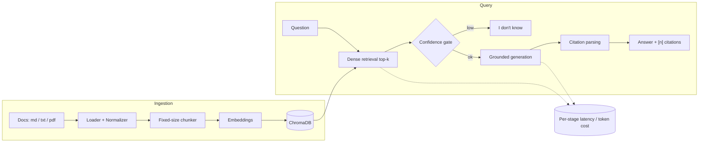

# RAG Hybrid Search

[](https://github.com/AlirezaAbedinii/rag-hybrid-search/actions/workflows/ci.yml)

[](https://github.com/astral-sh/ruff)


A production-grade **Retrieval-Augmented Generation** service over technical
documentation. It ingests multi-format docs, retrieves the most relevant
passages, and generates **grounded answers with inline `[n]` citations** —
refusing to answer when the retrieved context isn't strong enough, rather than
hallucinating. Every request is instrumented for **per-stage latency and
cost-per-query**.

The system is built as a **dense-only vertical slice first** (working end to
end), then extended with hybrid retrieval, an evaluation harness, and a UI. See
[Project status](#project-status).

---

## Highlights

- **Grounded answers, real citations.** Answers are generated strictly from
  numbered retrieved context; every `[n]` is parsed back to the exact source
  chunk, and out-of-range citations are flagged rather than silently dropped.
- **Honest refusal.** A retrieval-confidence gate returns a structured
  "I don't know" *before* calling the LLM when context is weak — no fabrication,
  no wasted generation cost.
- **Cost & latency from day one.** Per-stage timers (`embed`, `dense`,
  `generate`, …) and token-based cost accounting are wired through the pipeline,
  not bolted on at the end.
- **Pluggable providers.** OpenAI by default, with an offline
  `sentence-transformers` embedding swap behind the same interface for
  zero-cost local runs.
- **Tested & linted.** Deterministic unit/integration tests with the LLM mocked
  (no network), enforced by `ruff` + `pytest` in CI.

## Architecture



Planned **hybrid** path (see roadmap): BM25 sparse retrieval → Reciprocal Rank
Fusion → cross-encoder rerank, slotting in between retrieval and generation.

## Quickstart

Requires **Python 3.11+**.

```bash
git clone https://github.com/AlirezaAbedinii/rag-hybrid-search.git
cd rag-hybrid-search
python -m venv .venv && source .venv/bin/activate
pip install -e ".[dev]"

make test      # run the suite (deterministic, no network, no API key)
make lint      # ruff
```

### Ingesting documents

The repo ships with a small sample corpus of synthetic technical docs under
`data/raw/ferry_docs/`. Chunk it without any API key or heavy dependencies:

```bash
python scripts/ingest.py --dry-run      # load + chunk only; prints chunk count
```

For a real index (embeddings + Chroma), configure a key and install the
ingestion/indexing extras:

```bash
cp .env.example .env                     # set OPENAI_API_KEY
pip install -e ".[ingestion,indexing,llm]"
python scripts/ingest.py                 # embed the sample corpus into ChromaDB
```

### Run everything with Docker (API + UI)

```bash
cp .env.example .env                 # set OPENAI_API_KEY
docker compose up -d --build         # API on :8000, UI on :8501
docker compose run --rm seed         # index the sample corpus (idempotent)
```

Then open the UI at <http://localhost:8501>, browse the OpenAPI docs at
<http://localhost:8000/docs>, or query directly:

```bash
curl -X POST http://localhost:8000/v1/ask \
  -H "Content-Type: application/json" \
  -d '{"question": "What does FERRY-429 mean?", "mode": "dense", "top_k": 5}'
```

The response includes the answer, `[n]` citations mapped to source chunks, the
ranked retrieved contexts, a confidence score, token usage, `cost_usd`, and
per-stage `timings_ms`. Other endpoints: `POST /v1/ingest`, `GET /v1/documents`,
and `GET /v1/stats` (P50/P95/P99 latency per stage + cost totals).

### Asking a question (programmatic)

```python
from rag.pipeline import RAGPipeline

pipe = RAGPipeline.from_settings(mode="dense")
result = pipe.answer("How does the system handle job failures?")

print(result.answer)                 # grounded text with [n] citations
print(result.citations)              # each [n] mapped to its source chunk
print(result.refused)                # True -> structured "I don't know"
print(result.cost_usd, result.timings_ms)
```

## Configuration

All settings load from the environment (or a `.env` file) via
[`src/rag/config.py`](src/rag/config.py); see [`.env.example`](.env.example) for
the full list. Importing config never requires a secret — keys are validated
lazily, only when a provider is actually called. Notable knobs:

| Variable | Default | Purpose |
|---|---|---|
| `LLM_PROVIDER` / `EMBEDDING_PROVIDER` | `openai` | Pick one generation provider; offline embeddings available |
| `GENERATION_MODEL` / `EMBEDDING_MODEL` | `gpt-4o-mini` / `text-embedding-3-small` | Model IDs |
| `TOP_K` | `10` | Chunks retrieved per query |
| `CHUNK_SIZE` / `CHUNK_OVERLAP` | `800` / `120` | Fixed-size chunker |
| `RETRIEVAL_CONFIDENCE_THRESHOLD` | `0.30` | Below this → "I don't know" |
| `PRICE_*_PER_1M` | — | Token prices used for cost accounting |

## Project layout

```
src/rag/
├── config.py            # settings, model IDs, prices, thresholds (from env)
├── ingestion/           # loaders, normalizer, fixed-size chunker
├── indexing/            # embeddings client, ChromaDB wrapper
├── retrieval/           # dense retrieval + dense/hybrid mode switch
├── generation/          # grounded prompt, LLM client, citation parsing
├── observability/       # per-stage latency + token/cost accounting; trace store
├── api/                 # FastAPI app: /v1/ask, /v1/ingest, /v1/documents, /v1/stats
└── pipeline.py          # retrieve → gate → generate → cite
eval/                    # golden set + LLM-as-judge harness (correctness, faithfulness)
ui/app.py                # Streamlit front end (citations, chunks, cost panel)
scripts/                 # ingest.py (CLI) + seed.py (index the sample corpus)
tests/                   # deterministic tests (LLM mocked)
```

## Tech stack

Python 3.11+ · ChromaDB · OpenAI `text-embedding-3-small` (offline
`sentence-transformers` swap) · OpenAI / Anthropic for generation · FastAPI ·
Streamlit · Docker Compose · `pydantic` settings · `ruff` · `pytest`.
Planned: `rank_bm25`, cross-encoder reranker.

## Project status

The dense-only pipeline is complete end to end — ingestion through API/UI, with
an evaluation harness — and served via Docker Compose. The hybrid-retrieval
differentiators are in progress.

**Done**
- [x] Multi-format ingestion (Markdown, text, PDF) → normalize → fixed-size
      overlapping chunks with stable IDs and source/section/page metadata
- [x] Embeddings (OpenAI, offline swap) → persistent ChromaDB with idempotent
      upsert
- [x] Dense retrieval (top-k cosine) with a `dense` / `hybrid` mode switch
- [x] Grounded generation with inline `[n]` citations mapped to sources
- [x] Retrieval-confidence-gated "I don't know" refusal
- [x] Per-stage latency + token/cost instrumentation + per-request trace store
- [x] LLM-as-judge evaluation (correctness + faithfulness) over a 15-question
      hand-written golden set, with a CI-safe mocked smoke run
- [x] FastAPI service: `POST /v1/ask` (answer + citations + confidence +
      latency/cost), `POST /v1/ingest`, `GET /v1/documents`, `GET /v1/stats`
- [x] Streamlit UI: clickable citations, ranked chunks, confidence,
      dense/hybrid toggle, latency/cost panel
- [x] Docker Compose stack (API + persistent Chroma volume + UI) + seed script
- [x] Deterministic test suite + CI (ruff + pytest + eval smoke)

**Roadmap**
- [ ] Hybrid retrieval: BM25 sparse index + Reciprocal Rank Fusion +
      cross-encoder reranker (top-20 → top-5)
- [ ] Recursive + semantic chunkers (switchable) and near-duplicate dedup
- [ ] Two more eval metrics (retrieval relevance, citation accuracy) +
      hybrid-vs-dense and chunking-strategy comparison tables
- [ ] Citation verification + composite confidence score

## Development

```bash
make test     # pytest (works without install via pythonpath=src)
make lint     # ruff check .
make install  # pip install -e ".[dev]"
```

CI runs `ruff` + `pytest` + a mocked evaluation smoke run on every push. Tests are
deterministic and mock the LLM, so no paid API calls are made in CI.

## License

[MIT](LICENSE)
